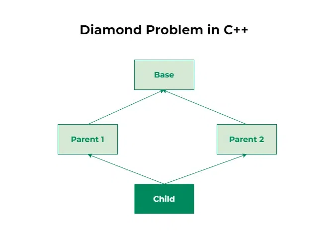

Diamond problem in C++

The Diamond Problem is an ambiguity error that arises in multiple inheritance when a derived class inherits from two or more base classes that share a common ancestor. This results in the inheritance hierarchy forming a diamond shape, hence the name “Diamond Problem.” The ambiguity arises because the derived class has multiple paths to access members or methods inherited from the common ancestor, leading to confusion during method resolution and member access.

Virtual Inheritance as a Solution:

Virtual inheritance allows you to specify that only a single instance of the base class should be inherited by any derived classes, thus preventing multiple "copies" of the base class being included in the extended class hierarchies.